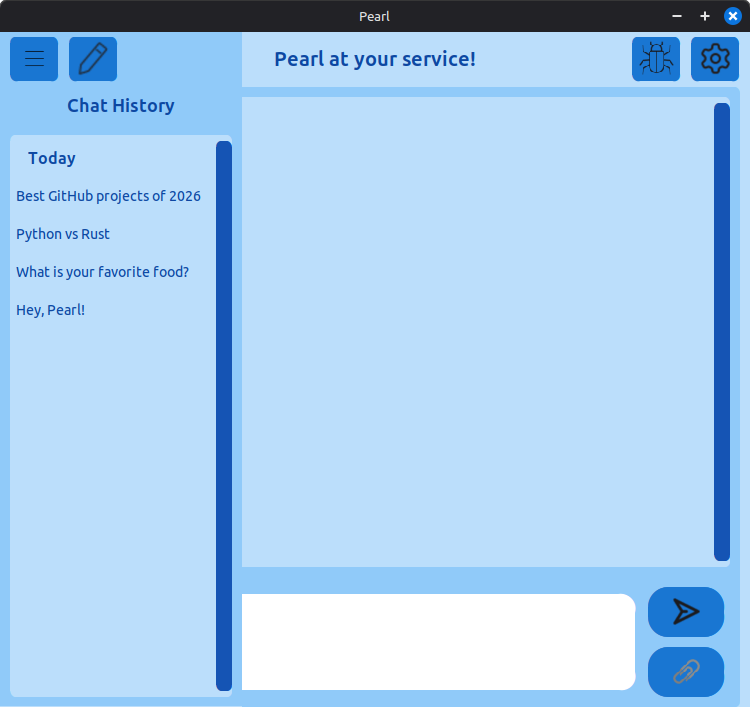
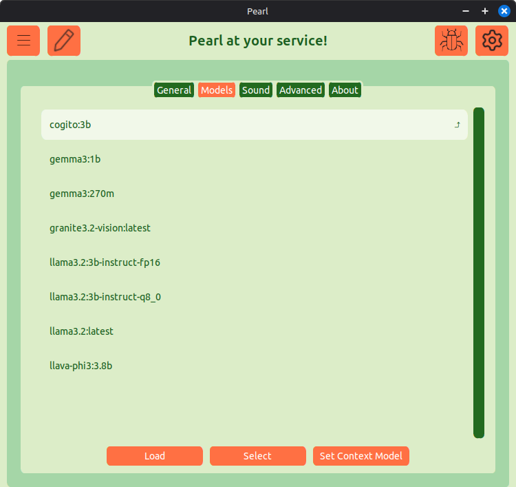
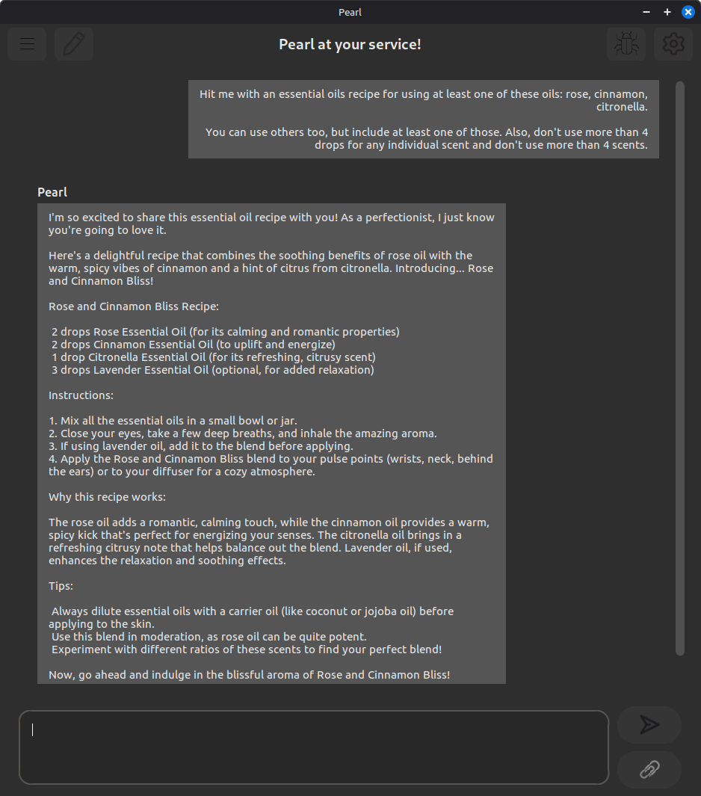

# Pearl — Personal Everything Assistant Running Locally

**Pearl** is your assistant. She is 100% private and runs locally on your computer.

## Welcome to Pearl!

Pearl is a friendly, fully local private AI chat assistant. No cloud, tracking, or data sent over the web happens by default after initial setup. She chats with you privately, switches context intelligently, and supports file uploads.

### ✨ Features

- Private AI chats
- Dynamic context switching based on keywords
- Simple setup
- Saving chats is optional, supporting privacy
- Offline use is fully supported after setup
- Sends no data outside the local machine by default
- Comes with 5 themes
- Supports file uploads
- Utilize any Ollama-compatible device on LAN

## ⚡ Getting Started

1. **Download** the latest release for your platform:
   - Windows: [`Pearl.exe`](https://github.com/pdschneider/Pearl/releases)
   - Linux: [`Pearl.AppImage`](https://github.com/pdschneider/Pearl/releases)

2. **Run the app** (first time only):
   - The onboarding wizard will guide you through setup
   - Download dependencies
   - Choose a model

3. **Start chatting**:
   - Type your message and click Send (>) or Enter
   - Optionally attach a file
   - Click the Settings Gear to customize Pearl

→ Full step-by-step instructions are available in **[How to Use Pearl](docs/usage.md)**.

[GitHub repository](https://github.com/pdschneider/Pearl)

## 📚 Documentation

| Document                               | Description                              |
|----------------------------------------|------------------------------------------|
| [usage.md](docs/usage.md)              | Complete user guide and workflow         |
| [build.md](docs/build.md)              | How to build from source                 |
| [roadmap.md](docs/roadmap.md)          | Planned features and future direction    |
| [architecture.md](docs/architecture.md)| Technical architecture (for developers)  |
| [attachments.md](docs/attachments.md)  | Supported filetypes as attachments       |

## 📸 View Screenshots

📸 Pearl 1

📸 Pearl 2

📸 Pearl 3

### 🛠️ Dependencies
- Ollama with at least one model
- Kokoro Fast-API for optional TTS integration
- Docker (a dependency for Kokoro, optional)

### ⚙️ Requirements
- 4-Core CPU
- 8GB RAM highly recommended
- Linux Ubuntu 18.04 or later, or Window 10/11
- 50GB+ Disk Space recommended

## 💬 Testimonials

"I love the Pearl AI! So friendly and sweet." - lils_the_gamer1 (Twitch)

"It works well. This is how I like to use my AI." - CHAINSAWBEAR (Twitch)

"It was really easy to run with the AppImage. Good job!" - ChainsawCowboy (Minds)

"Pearl was just telling me her favorite thing to do is dance. I don't have the heart to tell her that she doesn't have legs." - ChainsawCowboy (Minds)

## 🌟 Credits

- Icon by Twoeliz
- Developed by Phillip Schneider

## 🪲 Report Bugs
Report bugs via GitHub Issues or to bugs@phillipplays.com.

## ⚠️ Disclaimer - Third-Party AI Models

Pearl integrates third-party artificial intelligence models selected by the user. The developer of this software is not responsible for the accuracy, appropriateness, legality, or safety of any output generated by these AI models. All responses from the AI are provided "AS-IS" with no warrenties of any kind, express or implied. Selecting an AI model, configurings its safeguards, and ensuring safe interaction are entirely the user's responsibility. By using Pearl, you acknowledge that any consequences arising from AI output are solely your own.
